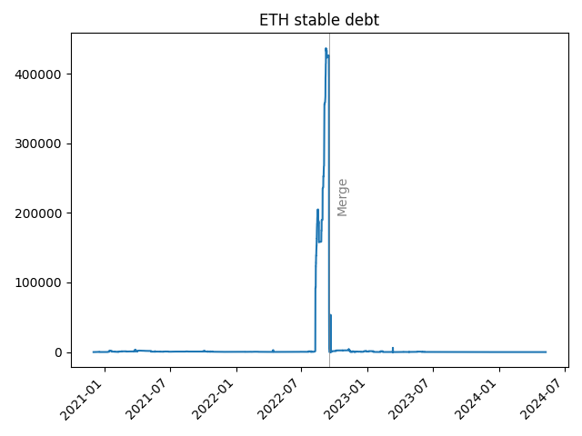
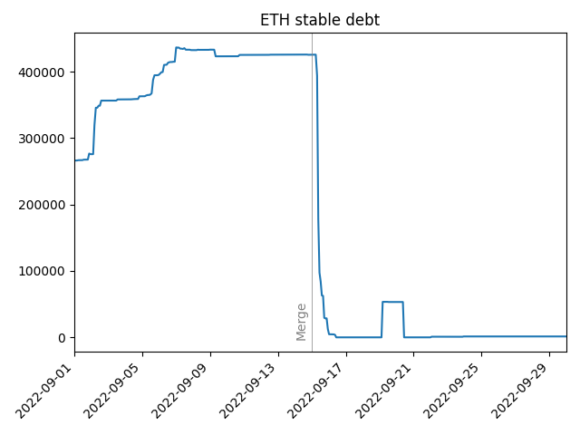
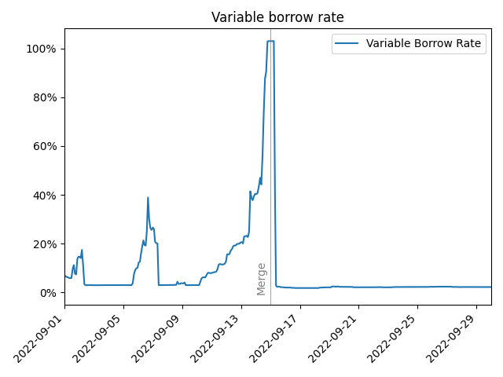
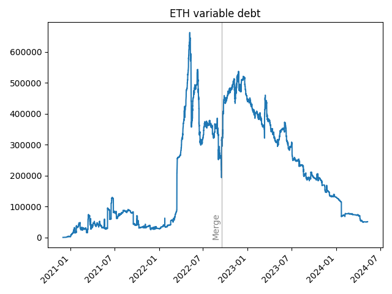

# The Ethereum Merge and the prospect of a new currency

When a blockchain like Ethereum goes through a hard fork, validators can choose whether transition to the new chain, or continue to validate on the legacy chain (or both).
If enough validators continue to keep the legacy fork alive, the two chains can run in parallel, with a shared history up to the moment of the fork.
Ethereum has had [many hard forks](https://medium.com/mycrypto/the-history-of-ethereum-hard-forks-6a6dae76d56f), and most of these are uncontentious, and the legacy fork simply disappears.

By contrast, the hard fork that [updated the Ethereum state](https://twitter.com/VitalikButerin/status/1188819235306213376) after the [DAO hack](https://web.archive.org/web/20181226204301/https://blog.slock.it/the-history-of-the-dao-and-lessons-learned-d06740f8cfa5) was quite [contentious](https://www.frontiersin.org/articles/10.3389/fbloc.2020.00025/full), 
and many miners rejected the new fork, and continued to mine on the old chain resulting in the creation of [ETH Classic](https://coinmarketcap.com/currencies/ethereum-classic/).
The behind-the-scenes drama that surrounded the hack and the eventual hard fork are described in detail in Laura Shin's book [The Cryptopians](https://www.hachettebookgroup.com/titles/laura-shin/the-cryptopians/9781541763005).

One interesting consequence of a fork like this is that after a fork, a single private key will now control the corresponding address *on both branches of the fork.*  In the case of the DAO fork, this meant that any user who had the private key for an address controlling ETH before the fork, 
would now be in control two addresses with equivalent amounts of ETH and ETH Classic after the fork.  Even though ETH Classic traded at a substantial discount relative to ETH, this still represented a fairly serious windfall to ETH holders.
Now, a key detail is that users will only get this windfall if the tokens are in their account at the moment of the fork.

In the event of a fork, other tokens besides ETH will fork as well, but these other tokens may not retain their value on the legacy chain.
For example, a stablecoin like [USDC](https://github.com/bhemen/usdc) would exist on both branches of the fork, but Circle would be unable to honor withdrawls on both branches of the fork (since their underlying assets were not duplicated when their tokens duplicated).
Before the Ethereum Merge, [Circle announced it would only support the Proof-of-Stake chain](https://www.circle.com/blog/usdc-and-ethereums-upcoming-merge).
If USDC on the PoW branch of the fork could not be redeemed for dollars held by Circle, their value would drop to zero.
Even if the value did not drop, Circle holds the keys to the USDC contract, which would allow them to simply shut down the contract on the Proof-of-Work branch, and effectively eliminate USDC from the Proof-of-Work branch entirely.

This power to shut down specific ERC-20s gives entities like Circle the role of "kingmaker" in the event of a fork, since the branch supported by USDC and USDT is likely to be the one that gains traction with the community.
At the time of the DAO fork, USDC and USDT had not yet been deployed on Ethereum, so this was not a concern, but at the time of The Merge, centralized stablecoins like USDC and USDT played a big role in the DeFi ecosystem.

Although there was overwhelming support for the Proof-of-Stake branch of the fork, [some exchanges announced support for ETHPoW tokens](https://thedefiant.io/news/markets/exchanges-pow-die-hards).
In light of Circle's announcement, a user holding ETH before the merge would find themselves holding ETH on both chains, but a user holding USDC before the merge would find themselves holding USDC on the Proof-of-Stake branch, 
and effectively nothing on the Proof-of-Work branch.

This created an incentive to use USDC as collateral to borrow ETH immediately before the merge.
Then, after the merge the borrower would hold ETH on both branches, they could then default on their loan on the Proof-of-Work branch, resulting in the loss of their (worthless) USDC.

This type of behavior is actually quite anomalous on Aave.  Under normal circumstances, Aave users post ETH as collateral in order to borrow stablecoins like USDC 
(with the goal of going long ETH by selling the USDC for ETH).
In the period of time directly preceding the merge, however, we did see a dramatic spike in ETH borrows.
In fact, demand for ETH on Aave became so intense that they protocol actually [halted ETH borrowing](https://cointelegraph.com/news/aave-community-proposes-to-temporarily-suspend-eth-lending-before-the-merge).

## Problems with excessive ETH borrowing

Block Analytica cited [two main reasons when they proposed halting ETH borrowing](https://governance.aave.com/t/arc-aave-ethpow-fork-risk-mitigation-plan/9438)

1. **The protocol needs funds to pay liquidators**.  Suppose a borrower uses ETH as collateral and borrows USDC.  If the price of ETH drops, and the borrower faces liquidation, a liquidator can pay USDC to obtain ETH from the protocol.  Aave can lend out the borrower's collateral (a lender [can to choose to use their deposits as collateral](https://docs.aave.com/developers/core-contracts/pool#setuserusereserveascollateral)), 
    and if *all* the ETH in the pool has been lent out, there will be no ETH left to pay a liquidator who wishes to liquidate an underwater position collateralized by ETH.  Even in this situation, the Aave protocol holds some collateral -- for example, suppose user A used ETH as collateral to borrow USDC, and user B used WBTC as collateral to borrow ETH.
    If user A's position becomes under-collateralized and goes up for liquidation, the protocol does not have ETH to pay the liquidator, but *does* have WBTC.  Unfortunately, the protocol is not set up to allow this type of pass-through liquidation.  The protocol will only pay the liquidator ETH, and if the protocol has no ETH, the liquidation cannot proceed.
2. **This puts recursive yield leveraging at risk**. Outside of the merge, the main reason users borrow ETH from Aave is for [recursive yield leveraging](https://help.lido.fi/en/articles/8459223-guide-how-to-use-steth-wsteth-on-aave).  The basic idea is that a user deposits ETH in to Lido, receives stETH, then uses the stETH as collateral on Aave to borrow more ETH, 
    which can then be deposited in Lido.  In Aave, the borrow interest rate is a function of the utilization rate, so when *all* the ETH is lent out, the borrower [interest rate can get over 300%](https://docs.aave.com/risk/liquidity-risk/borrow-interest-rate#rate-strategy-volatile-one).
    Because interest is applied directly to the borrower's debt, this causes borrower debt to balloon, and inattentive borrowers may be liquidated as their debt position grows above the liquidation threshold.  Even if users are not liquidated, as ETH borrow rates increase, this type of yield leveraging becomes impractical 
    (you cannot make money if it costs more to borrow ETH than you make by staking in Lido).  If this is the case, users would likely unwind their positions, repaying their ETH and regaining their stETH.  With yield leveraging out of the picture, the price of stETH might drop, causing further liquidations across Aave.

The [Aave governance proposal](https://governance-v2.aave.com/governance/proposal/97/) pausing ETH borrowing passed on September 6th, 2022.

## The Pre-Merge Turbulence and Strategic Pauses

Aave allows both "[stable](https://docs.aave.com/risk/v/aave-v2/liquidity-risk/borrow-interest-rate#stable-interest-rate-model-parameters) interest rate borrowing as well as [variable-rate](https://docs.aave.com/risk/v/aave-v2/liquidity-risk/borrow-interest-rate) borrowing.
In general, most Aave users prefer variable-rate borrowing, but leading up to the merge, the number of users borrowing ETH at the "stable" rate began to spike

  

Zooming in around the date of the merge, we can see how quickly these loans were repaid immediately after the merge

  

These stable borrowers were anticipating the high demand for ETH around the merge, which would cause a spike in interested rates, and trying to lock in favorable rates before the spike.
These borrowers were correct, and the variable-interest rate peaked at over 100% right before the merge.

  

On September 7, 2022, about a week before the merge, Aave token holders [voted to temporarily suspend ETH borrowing](https://governance-v2.aave.com/governance/proposal/97/).
The suspension was set to last until September 18, 2022, providing a buffer period through the Merge to stabilize the market and protect the protocol. 
In addition to freezing new ETH borrows, the proposal suggested increasing the maximum variable interest rate to 1,000% at 100% utilization.

Zooming out, we see that although the merge caused a huge spike in *stable-rate* borrowing, it did not cause a comparatively massive spike in variable-rate borrowing.

  

## Data 

These plots were generated by [plot.py](code/plot.py), and the underlying data is available in the [data](data/) folder.
The data was collected from an Ethereum full archive node using the script [get_lending_data.py](code/get_lending_data.py).

These data files are relatively small in size because they only contain pool-level data (e.g. TVL and interest rates at a given block).
We have also scraped *user-level* event data, as described below.

## Interactive Analysis and user-level event data

For those interested in exploring these dynamics further, interactive plots can created using the Jupyter notebook titled [`aave_v2_analysis_plots.ipynb`](./code/aave_v2_analysis_plots.ipynb).

These interactive plots are built using Plotly, allowing you to engage more deeply with the data. By double-clicking on any asset in the Plotly legend, you can isolate and view the plot for that specific asset. 
This feature is particularly useful for focusing on the data that is most relevant to your analysis or interests. 
Additionally, you can hover over any part of the plot to see detailed values and asset names, providing a clearer view of the data during different time intervals or under various conditions. 
This functionality enhances the usability of the plots, making it easier to derive insights and understand the market dynamics around the Ethereum Merge.

Due to their large size, the following files are not hosted on GitHub but can be downloaded from these links:

- [aave_collateralization_v2.csv](https://upenn.box.com/shared/static/rjgq5fjkmh1blem46c4edibjsfk056jx.csv)
- [aave_collateralization_meta_v2.csv](https://upenn.box.com/s/rnuz37qc03en2grs6h4xu58n880azu1u)

These files, along with [`aave_atokens_v2.csv`](./data/aave_atokens_v2.csv), are used in the Jupyter notebook `aave_v2_analysis_plots.ipynb`. Please download and place all these files in the data folder for this project before running the notebook.

Further analyses using these larger Aave data sets are available at [https://github.com/bhemen/aave-data](https://github.com/bhemen/aave-data).

