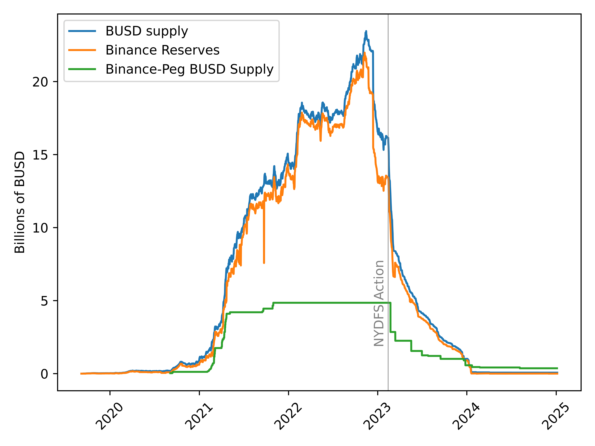

# BUSD

BUSD was a dollar-backed stablecoin issued by Paxos.  Native [USDT](https://tether.to/en/transparency/?tab=usdt) and [USDC](https://www.circle.com/multi-chain-usdc) are *not* available on the BNB chain, 
and BUSD was the dominant stablecoin available on the BNB chain.

Despite its name, BUSD was not issued directly on the BNB chain.  Instead, Paxos issued BUSD on Ethereum (at address [0x4fabb145d64652a948d72533023f6e7a623c7c53](https://etherscan.io/token/0x4fabb145d64652a948d72533023f6e7a623c7c53).
Each Ethereum-based BUSD was backed by a dollar held by Paxos, and Paxos issued [monthly transparency reports](https://paxos.com/busd-transparency/) reports detailing its reserves.

Binance would then custody BUSD (on Ethereum) and issue Binance-Peg BUSD (on BNB chain).  The idea was that every Binance-Peg BUSD was backed by a BUSD held by Binance, and every BUSD was backed by a dollar held by Paxos.

In February 2023, [NYDFS ordered Paxos to stop minting BUSD](https://www.dfs.ny.gov/consumers/alerts/Paxos_and_Binance) (on Ethereum).
The order came after [reports that Binance was minting unbacked 'Binance-Peg' BUSD on the BNB chain](https://www.bloomberg.com/news/articles/2023-02-13/circle-usdc-alerted-new-york-over-binance-peg-busd-issues).

Although Binance did not provide monthly audit reports, since BUSD is an on-chain asset, if the Binance custody addresses are known, we can look on Ethereum to see how much BUSD Binance holds, and then look on BNB chain to see how much Binance-Peg BUSD Binance has issued.  If the supply of Binance-Peg BUSD on BNB chain every exceeds the amount of BUSD held by Binance, then we could conclude that Binance was printing unbacked 
Binance-Peg BUSD.

Conveniently, [Binance provides a list of addresses](https://www.binance.com/en/blog/community/our-commitment-to-transparency-2895840147147652626) they use to custody funds.
The script [get_binance_addresses.py](code/get_binance_addresses.py) grabs these addresses and writes them to the csv [data/binance_addresses.csv](data/binance_addresses.csv) for easy parsing

Using an Ethereum archive node, we can look at the historical BUSD balances of these addresses to see how much BUSD Binance had in custody at any given time.  This is done by the script [get_binance_reserves.py](code/get_binance_reserves.py).  Then, we can look at the amount of Binance-Peg BUSD in circulation on the BNB chain.  This is done by the script [bnb_supplies.py](code/bnb_supplies.py)  If the amount of circulating Binance-Peg BUSD ever exceeds the reserves, we would have definite proof that Binance was minting unbacked Binance-Peg BUSD.

The figure shows the total circulating supply of BUSD (on Ethereum), the amount of BUSD held by Binance (on Ethereum) and the supply of Binance-Peg BUSD (on BNB chain).  From this, we can see

* Binance controlled almost the entire supply of BUSD on Ethereum
* The supply of BUSD and Binance-Peg BUSD dropped precipitously after the action from NYDFS in February 2023
* It appears that Binance always had more BUSD in reserves than the amount of Binance-Peg BUSD in circulation, so this provides no direct evidence of the claim against Binance

It is important to note, however, that although Binance had more (and often significantly more) BUSD in its reserves than it had issued Binance-Peg BUSD, this does **not** mean that the Binance-Peg BUSD was always fully backed.  Binance may have had other claims on the BUSD held in its Ethereum wallets.  For example, it could have been BUSD held on behalf of its users.  Without knowning these other claims, we cannot know for sure whether all of the issued BUSD was fully backed.

During the phaseout of BUSD, [Binance encouraged its users to convert their BUSD to FDUSD](https://www.binance.com/en/support/announcement/binance-completes-the-conversion-of-busd-token-balances-to-fdusd-b7d1cd119211458eb676a9a324edf314).  Although USDT and USDC are not currently issued on the BNB chain, [Circle and Binance have entered into a partnership](https://www.circle.com/pressroom/circle-and-binance-enter-into-a-strategic-partnership-that-will-accelerate-global-usdc-and-crypto-adoption), so we may see USDC on the BNB chain in the future.