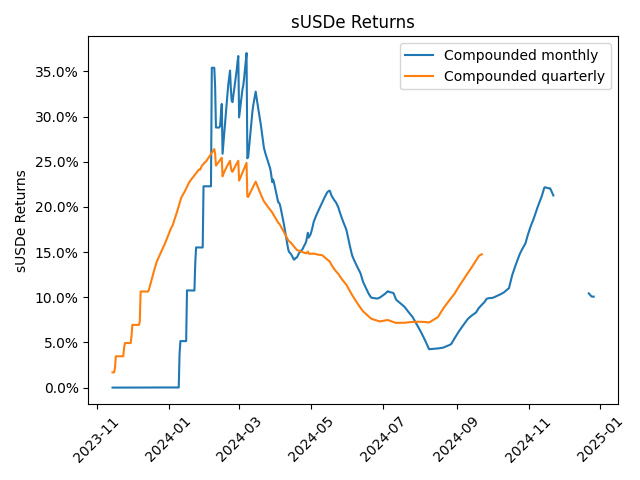
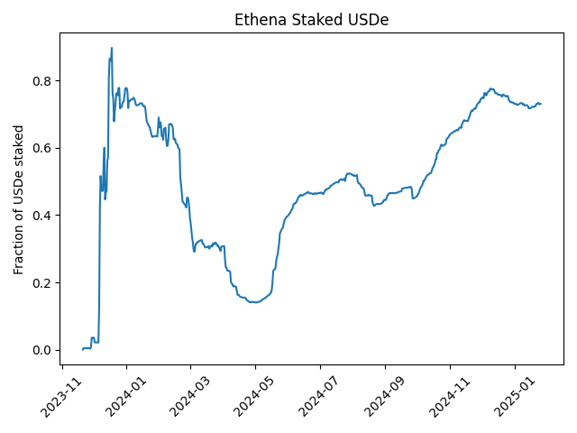

# Ethena

Ethena is an Ethereum-based protocol offering a "synthetic" dollar token called USDe.

---
**Note:**
Many bridges append `.e` for bridge wrapped tokens, for example [USDC.e](https://polygonscan.com/token/0x2791bca1f2de4661ed88a30c99a7a9449aa84174) on Polygon or [USDC.e](https://snowtrace.io/token/0xa7d7079b0fead91f3e65f86e8915cb59c1a4c664) on the Avalanche C-Chain.  Ethena's [USDe](https://etherscan.io/address/0x4c9edd5852cd905f086c759e8383e09bff1e68b3) is not a bridge-wrapped token, and has nothing to do with these bridge-wrapped tokens that also append an "e" to their symbol.

---

To understand Ethena's USDe, it is useful to consider it in relation to other stablecoins.  Fiat-backed stablecoins like USDT or USDC are backed by dollar-denominated assets (e.g. short-term treasuries) held off-chain by their issuer (Tether or Circle).  Since USDT and USDC are backed by dollars, the issuer can issue one stablecoin for each dollar in reserve.  For crypto-backed stablecoins like USDS (formerly DAI), the issuer must *over-collateralize* each stablecoin issued because the underlying collateral fluctuates in price (relative to the dollar).  So a user might have to deposit \$1.50 worth of ETH (or BTC) to mint 1 USDS, to account for the fact that the price of the collateral (ETH) might drop relative to the debt (USDe).  For this reason, USDS (DAI) has often been [criticized](https://multicoin.capital/2021/09/02/solving-the-stablecoin-trilemma/) as [capital inefficient](https://www.forbes.com/sites/digital-assets/2023/03/02/unstable-dai-dynamics-could-kill-ethereums-favorite-crypto-backed-stablecoin/).

One way to address this problem is to hedge the risk that the collateral drops in value.  This the approach taken by Ethena.
Ethena allows users to mint 1 USDe by putting up \$1 worth of ETH (or BTC) as collateral.  Ethena holds this collateral, but then opens a short position for \$1 worth of ETH on a centralized exchange (like Binance).  You can see exactly which exchanges Ethena is using on their [transparency page](https://app.ethena.fi/dashboards/transparency).

This allows Ethena to mint USDe without over-collateralizing.  If the price of ETH drops, the short position will make up the loss.

# Generating yield

Ethena effectively shorts its collateral using [perpetual futures](https://cointelegraph.com/explained/what-are-perpetual-futures-contracts-in-cryptocurrency) contracts, and during bull markets the [funding rate](https://www.binance.com/en/blog/futures/what-is-futures-funding-rate-and-why-it-matters-421499824684903247) is usually positive, meaning that Ethena gets *paid* to hold these short positions.  The funding rates are fairly volatile, but can be quite high.  Currently (January 2025), the funding rate on [Binance BTC perpetual futures](https://www.binance.com/en/futures/funding-history/perpetual/funding-fee-history) is 0.01% every 8 hours, which translates to roughly 11% APY.

In order to juice yield more, if the user deposits ETH to mint USDe, Ethena stakes the ETH with [Lido](https://lido.fi), earning an additional 3% or so APY.

# Distributing yield

Although Ethena's rapid growth is mainly attributable to the yield it pays users, Ethena does **not** distribute yield to USDe holders.  Instead, in order to receive yield, you must opt-in to receiving yield by staking your USDe with Ethena.  Users who stake USDe receive a yield-bearing asset sUSDe.

Ethena generates yield on all the assets backing USDe, and then only distributes this yield to the fraction of users who've staked their USDe.
For example, if the Ethena protocol is generating 8% yield on its collateral, but only 50% of USDe holders have staked, the sUSDe holders will receive 16% yield.  This type of mechanism is often called "Yield Amplification" (or "[Yield Discrimination](https://www.youtube.com/watch?v=Ild-vtexsMM&t=1362s)"), and [Robert Leshner called "Yield Amplification" his favorite mechanism of 2024](https://youtu.be/IVIyAYTm1Fo?list=PLySrw1Nvf-srh6ZnJ033Jb440VKUjVNgX&t=1773)

# Historical yield

The plot below shows the effective APY you would have received if you had staked USDe at a given date and left it staked for either 1 month or 1 quarter.



The plot below shows what fraction of the circulating USDe was staked at a given time.  The less USDe that is staked, the higher the yield amplification.  This means that Ethena is "anti-reflexive" -- as the underlying yield goes up, more people should stake USDe, and the yield amplification should decrease.  Conversely, when the underlying yield goes down, more people should unstake, and the yield amplification should increase.  Ethena's founder, Guy Young, discusses some of Ethena's other anti-reflexive properties on [The Chopping Block](https://youtu.be/IVIyAYTm1Fo?list=PLySrw1Nvf-srh6ZnJ033Jb440VKUjVNgX&t=2849).



The figures were generated by [plot_ethena.py](code/plot_ethena.py)

# Calculating Yield

The [sUSDe contract]() is implemented following the [ERC-4626 "vault" standard](https://ethereum.org/en/developers/docs/standards/tokens/erc-4626/), which means that it supports the `previewDeposit()` and `previewRedeem()` functions.

* `previewDeposit()` tells you how many LP tokens (in this case sUSDe) you would get for a given deposit of the base asset (in this case USDe).
* `previewRedeem()` tells you how many USDe you would get by "redeeming" (effectively burning) a given amount of sUSDe.

By calling
```
deposit_amount = 100
lp = previewDeposit(deposit_amount).call(block_identifier=start_block)
withdraw_amount = previewRedeem(lp).call(block_identifier=end_block)
```
We can see exactly how much a user *would have earned* on a stake of `deposit_amount` between the blocks `start_block` and `end_block`.

These data are collected by [ethena_returns.py](code/ethena_returns.py).
Running this script requires a full archive node.

---
**Note:**
An alternative method for calculating yield is to look at the [price of sUSDe on the market](https://coinmarketcap.com/currencies/ethena-staked-usde/).  Since sUSDe is not rebasing, the ratio of the price of sUSDe between two time points will give the yield you would have received if you had staked (or bought sUSDe) at the first time point and sold (or redeemed) sUSDe at the second time point.
Unfortunately, as the market price of sUSDe is not available on chain, so we cannot use this method.

---

# Calculating staking 

To calculate the fraction of USDe that's staked as sUSDe, we can simply call the `totalSupply()` function on USDe to get the total supply of USDe at a given block height, then call the `balanceOf()` function on the USDe contract to get the balance of USDe held by the sUSDe vault.  This ratio will give us the fraction of USDe staked as sUSDe.

These data are collected by [ethena_staking.py](code/ethena_staking.py).
Running this script requires a full archive node.
