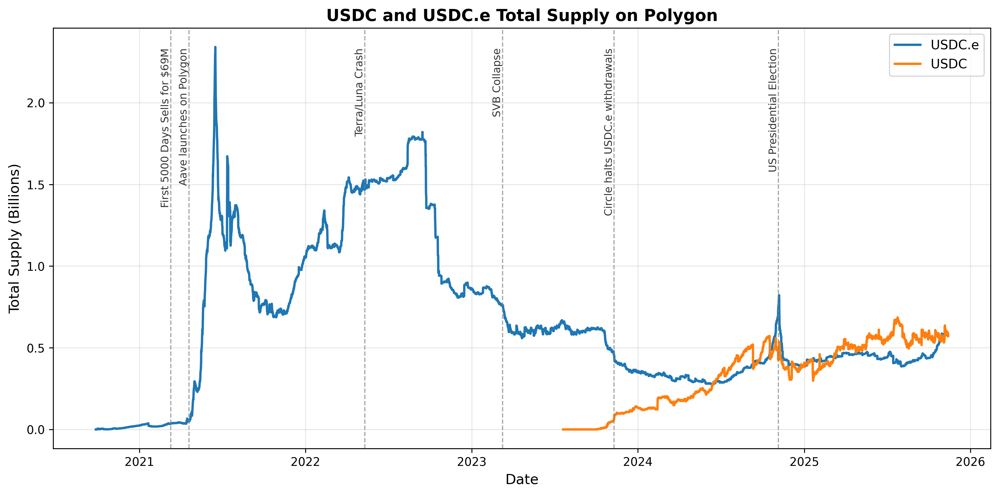
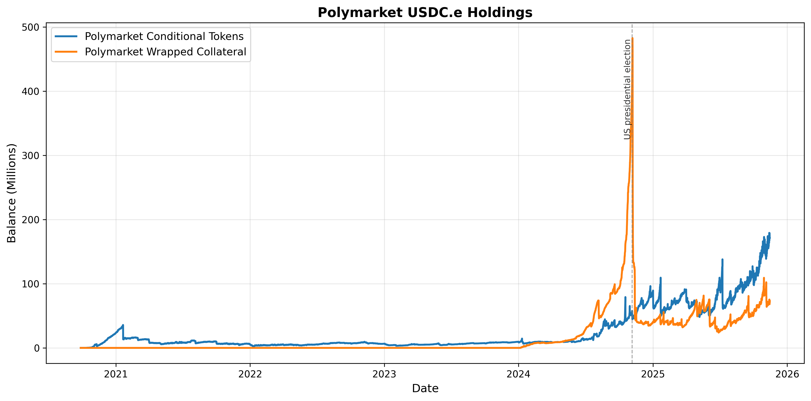

# USDC on Polygon

Circle launched USDC on Polygon in [October 2023](https://www.circle.com/blog/native-usdc-now-available-on-polygon-pos).
Prior to the launch of "native" USDC on Polygon, Polygon users could access "Bridge-Wrapped" USDC (with ticker symbol USDC.e).
USDC.e was a derivative token, issued by the Polygon Bridge.

Because it is impossible to move tokens from one blockchain to another, 
most blockchain bridges (including the Polygon bridge) custody "native" assets on the source chain, 
and issue derivative assets on the destination chain.

The Polygon bridge has [a contract](https://intel.arkm.com/explorer/address/0x40ec5B33f54e0E8A33A975908C5BA1c14e5BbbDf) on Ethereum 
which custodies native USDC (on Ethereum), and separate contracts on Polygon that manage the derivative asset (USDC.e).
At a high level, when users deposit "real" USDC on Ethereum, the bridge will mint "derivative" USDC.e on Polygon.
The USDC.e on Polygon *cannot* be redeemed for US Dollars with Circle (since Circle does not issue USDC.e), but 
the USDC.e (on Polygon) *can* be redeemed for USDC (on Ethereum) through the Polygon bridge.

The plot below shows the total circulating supply of USDC and USDC.e on Polygon

There are a few key points to highlight here:

1. The total supply of USDC on Polygon is quite small compared to the total amount of USDC in circulation on all chains.
1. There is a huge spike in USDC.e in the spring of 2021, leading to "Defi Summer 2.0", 
    1. [Beeple's NFT sells for $69M at Christies](https://www.forbes.com/sites/jessedamiani/2021/03/12/beeples-the-first-5000-days-sold-to-metakovan-founder-of-metapurse-for-69346250/)
    1. The lending protocol, Aave [launched on Polygon](https://dappradar.com/blog/aave-launches-on-polygon-users-up-over-960)
1. Most of the major events that affected USDC did *not* seem to affect the USDC.e supply on Polygon 
    1. The Terra / Luna crash which resulted in a [boon for USDC](https://github.com/bhemen/crypto_insights/tree/main/usdc-usdt) on Ethereum did *not* result in an increase in USDC.e on Polygon.
    1. The SVB colapse which resulted in holders [fleeing USDC](https://github.com/bhemen/crypto_insights/tree/main/usdc-usdt) did *not* result in a decrease in USDC.e on Polygon
    1. Circle's push to move users to "native" USDC resulted in a steady increase in the USDC supply, and a decrease in the supply of USDC.e, but the change was not particularly dramatic.
1. We see a huge spike in the USDC.e supply around the US Presidential election in November 2024.  This occurs because [Polymarket](https://polymarket.com/) is the largest holder of USDC.e, 
    and the [US Presidential Election Market](https://polymarket.com/event/presidential-election-winner-2024/will-donald-trump-win-the-2024-us-presidential-election?tid=1716895924136) was the biggest market by far.

# Polymarket

Polymarket is consistently the largest USDC.e holder on Polygon, because bettors are required to place bets using USDC.e.
Note that although Polymarket [documentation says bets are placed in USDC](https://docs.polymarket.com/polymarket-learn/get-started/how-to-deposit), 
in fact, all Polymarket bets are in USDC.e.  The Polymarket contracts custody bettors' USDC.e for all open positions, which means that the 
Polymarket contracts are custodying huge amounts of USDC.e at any given time.

* [Polymarket Conditional Tokens](https://polygonscan.com/address/0x4D97DCd97eC945f40cF65F87097ACe5EA0476045)
* [Polymarket Wrapped Collateral](https://polygonscan.com/address/0x3A3BD7bb9528E159577F7C2e685CC81A765002E2)

Polymarket markets for binary (yes/no) events are custodied by the Polymarket Conditional Tokens contract, whereas 
markets with multiple (mutually exclusive) outcomes are handled by Polymarket's "Negative Risk" framework, 
and those bets are custodied by the Polymarkte Wrapped Collateral contract.  Since the US Presidential election had 
multiple potential outcomes, the bets in the Presidential market were held by the Polymarket Wrapped Collateral contract.
That's why we see a huge spike in the amount of USDC.e held by the Polymarket Wrapped Collateral contract, but 
not in the Polymarket Conditional Tokens contract during the 2024 Presidential Election.

# USDC and USDC.e tokens

The two flavors of USDC on Polygon are governed by the following contracts:

* [Bridge USDC.e](https://polygonscan.com/token/0x2791bca1f2de4661ed88a30c99a7a9449aa84174)
* [Native USDC](https://polygonscan.com/token/0x3c499c542cef5e3811e1192ce70d8cc03d5c3359)

