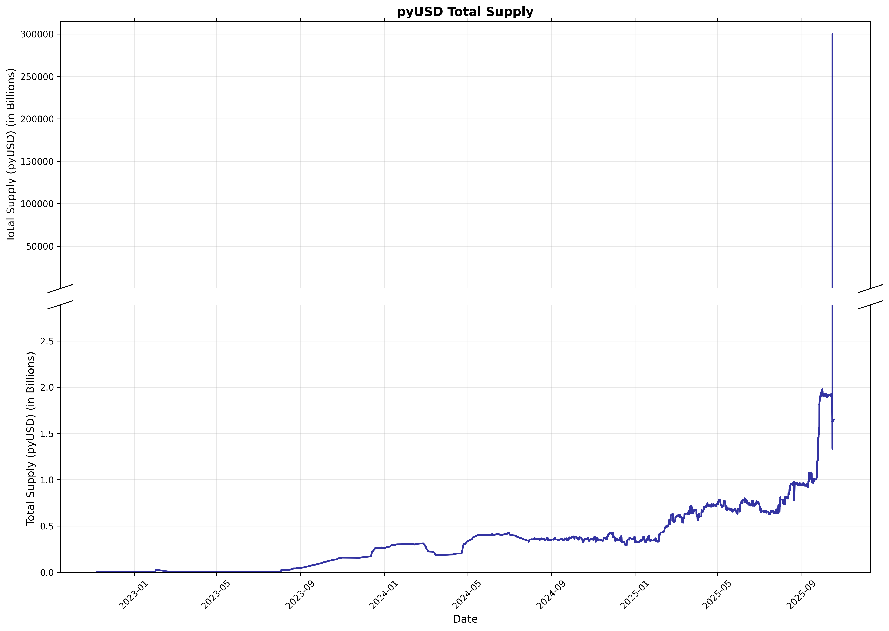

# 3 Trillion PyUSD Minted

On October 16th 2025, PayPal accidentally minted [3 Trillion PyUSD](https://www.coindesk.com/markets/2025/10/16/paxos-fat-fingers-usd300t-of-paypal-stablecoin-outpacing-usd-s-usd2-4t-supply).  This mistake was an embarrassment for Paxos and PayPal, but did not directly result in the loss of user funds.

# PyUSD

The [PyUSD contract](https://github.com/paxosglobal/pyusd-contract/blob/master/contracts/PYUSD.sol) is available on Github.  All of its interesting functionality is inherited from [Paxos Token V2](https://github.com/paxosglobal/paxos-token-contracts/blob/master/contracts/PaxosTokenV2.sol)

On Ethereum, the PyUSD address is [0x6c3ea9036406852006290770bedfcaba0e23a0e8](https://etherscan.io/address/0x6c3ea9036406852006290770bedfcaba0e23a0e8)

# Burning tokens

Stablecoins like PyUSD have methods for "burning" tokens.  Under normal operation, when a customer deposits US Dollars with Paxos, new PyUSD will be minted, 
and when a customer withdraws the underlying dollars the corresponding PyUSD tokens will be "burned."

One funny thing about this, is that when tokens are "burned" on a Paxos contract, 
it emits an [Event](https://www.alchemy.com/docs/solidity-events) that says the [tokens were sent to the 0x0 address](https://github.com/paxosglobal/paxos-token-contracts/blob/4421d2b5fe5d26300676b849cd84626bd0c1a079/contracts/PaxosTokenV2.sol#L389).  This led to some early reporting saying the coins were sent to a "null" or a "dead" wallet.  For example, 

For example, Halborn [wrote](https://www.halborn.com/blog/post/explained-the-paxos-pyusd-incident-october-2025)

>"After discovering the issue, Paxos quickly moved to resolve it; however, blockchain immutability means that a transaction recorded on-chain can’t just be reversed. Instead, the tokens were transferred to a burn address with an unknown private key, making them inaccessible to anyone.)"

Similarly, HODLFM [wrote](https://hodlfm.com/market/paxos-accidentally-mints-300-trillion-paypal-usd/)

>"Within roughly 22 minutes, the entire 300 trillion tokens were sent to an inaccessible burn address."

Although it is possible to send PyUSD to the 0x0 address (and the private key for this address is unknown), this is not what happened here, the tokens were simply burned.  The crucial distinction is that burning tokens reduces the circulating supply, whereas tokens that are simply transferred to a "dead" address will still be counted towards the circulating supply when you call the `totalSupply()` function which is part of the [ERC-20 Standard](https://eips.ethereum.org/EIPS/eip-20).  

# The Mistake

The difference between the intended amount (300 Million) and the actual amount (300 Trillion) is a factor of $10^6$.  The PyUSD contract uses [6 decimals](https://github.com/paxosglobal/pyusd-contract/blob/master/contracts/PYUSD.sol#L31).  This means that the smallest unit of PyUSD is $10^{-6}$, but it also means that 1 PyUSD is represented on chain by the number $10^6$.  Now, it is common for front-ends to handle this conversion for you.  For example, USDC also uses 6 decimals, so 1 USDC is represented on chain by a balance of $10^6$.  To make things simpler, if you go to a frontend like Uniswap, and you try to trade 1 USDC, the frontend will multiply your input by $10^6$ so it is suitable for inclusion on chain.

If a Paxos employee expected to have to input "raw" units, they would have inputted $3*10^{14}$ to mint 300 Million PyUSD.  If the frontend expected them to input decimal units, it would have multiplied their input by $10^6$, and the intended mint of 300 Million PyUSD would have been converted to 300 Trillion PyUSD.
# The on-chain actions

You can see the 
[mint transaction](https://etherscan.io/tx/0xc45dd1a77c05d9ae5b2284eea5393ecce2ac8a7e88e973c6ba3fe7a18bf45634) on chain, it happened in [block 23585095](https://etherscan.io/block/23585095) on October 15.

The [burn transaction](https://etherscan.io/tx/0xaa532ae7f06cccdbdc226f59b68733ae8594464a98e128365f8170e305c34f4b) occurred in 111 blocks later in [block 23585206](https://etherscan.io/block/23585206).  Since Ethereum slots are 12 seconds long, 111 blocks corresponds to approximately 22 minutes.

Both the mint and the burn transactions originated from address [0x2fb074FA59c9294c71246825C1c9A0c7782d41a4](https://etherscan.io/address/0x2fb074fa59c9294c71246825c1c9a0c7782d41a4).  This address is labeled as "Paxos 7" by Etherscan.

This indicates that it was Paxos who made the mistake -- not PayPal.
Arkham has some [more information about this address](https://intel.arkm.com/explorer/address/0x2fb074FA59c9294c71246825C1c9A0c7782d41a4).

One thing that stands out from both the Etherscan and Arkham is -- Why does this address have mint authority?  It's clearly a Paxos hot wallet.  It would make more sense to have a dedicated minter for PyUSD, and if you wanted, you could mint PyUSD **to** the Paxos hot wallet, but the Paxos wallet should not be doing the minting.

# Mitigations

There are many steps that Paxos could have taken to prevent this type error.
There could be controls within the smart contract itself, limiting the number of tokens that could be minted in a single transaction, or the number 
of tokens that could be minted in a given time period.  It would also be possible to have soft limits, for example requring multiple signers when minting larger quantities.

There could also be controls placed on the frontend.  As noted above, the fact that the intended mint amount and the actual mint amount differ by a factor of $10^6$, which is also the number of "Decimals" in the PyUSD contract makes it highly likely that this error was caused by *both* the user and the frontend multiplying the target amount by $10^6$.  Since Paxos' frontend is not on chain, it's difficult to know exactly how it works, but however it works, the frontend could be programmed to warn users when they attempt to mint more PyUSD than there are US Dollars in circulation.

# Minters

As of October 20th, 2025, there have only been 5 addresses that have minted PyUSD

|Minter| Total Value Minted|
|:---------------------------------------------------------------------------------------------------------------------------------|:--------------|
| [0x2fb074FA59c9294c71246825C1c9A0c7782d41a4](https://intel.arkm.com/explorer/address/0x2fb074FA59c9294c71246825C1c9A0c7782d41a4) | 300.0T        |
| [0xf845a0A05Cbd91Ac15C3E59D126DE5dFbC2aAbb7](https://intel.arkm.com/explorer/address/0xf845a0A05Cbd91Ac15C3E59D126DE5dFbC2aAbb7) | 5.1B          |
| [0x5D295C57aD82EE8B50F04454C1Da7550c33b286a](https://intel.arkm.com/explorer/address/0x5D295C57aD82EE8B50F04454C1Da7550c33b286a) | 1.2B          |
| [0xe93685f3bBA03016F02bD1828BaDD6195988D950](https://intel.arkm.com/explorer/address/0xe93685f3bBA03016F02bD1828BaDD6195988D950) | 113.4M        |
| [0x33172aF007BE3bE0999c5921F8c5D01E32f2549F](https://intel.arkm.com/explorer/address/0x33172aF007BE3bE0999c5921F8c5D01E32f2549F) | 1.1M          |
