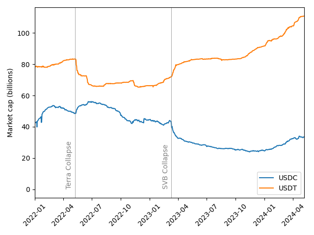

# Overview

In 2023, we saw Tether's market share increase steadily while USDC's market share saw a steady decrease.
The catalyst seemed to be the [collapse of Silicon Valley Bank](https://www.wsj.com/articles/silicon-valley-bank-svb-financial-what-is-happening-299e9b65) in March 2023.
Circle had \$3.3bn in reserves at SVB, and when SVB halted withdrawals [Coinbase stopped converting USDC to USD](https://www.coindesk.com/business/2023/03/11/coinbase-pauses-conversions-between-usdc-and-us-dollars-as-banking-crisis-roils-crypto/), 
and without the ability to withdraw, USDC lots its peg, dropping to [87 cents](https://www.theguardian.com/technology/2023/mar/11/usd-coin-depeg-silicon-valley-bank-collapse).

Within days, the situation was resolved.  Circle announced that none of the collateral was lost, and Coinbase began processing withdrawals again.

The total market cap of USDC at the time of SVB's collapse was over \$43bn, which means that the \$3.3bn held at SVB represented about 7.5% of the total collateral backing the token.
Although only 7.5\% of the collateral backing the USDC token was unavailable, the token price dropped 13\%.

Although the price of USDC recovered quickly after the run on SVB, the de-pegging shook people's faith in the token, and 
the collapes of SVB set off long-term decline in the circulating supply of USDC.  

  

Following the run on SVB, crypto users began moving their stablecoin holdings from USDC to USDT (Tether).  Interestingly, we saw the opposite behavior when [Terra / Luna crashed in 2022](https://www.coindesk.com/learn/the-fall-of-terra-a-timeline-of-the-meteoric-rise-and-crash-of-ust-and-luna/), 
at that time, users fled USDT for USDC.

# Data

The data was obtained by the script [get_charts.py](code/get_charts.py).
The plot was produced by [usdc-usdt-market-caps.py](code/usdc-usdt-market-caps.py).

Both [USDC](https://www.circle.com/en/multi-chain-usdc) and [USDT](https://tether.to/en/transparency) are deployed on several blockchains, so it is not possible to obtain the circulating supply by reading a single contract.
The data used to generate the plot above was obtained from CoinGecko, which aggregates both on- and off-chain data from several sources.
CoinGecko's [API](https://docs.coingecko.com/reference/introduction) only allows you to download data from the past year with their free plan.
The script [coingecko_scraper.py](code/coingecko_scraper.py) will do that.

To get full historical data (sampled daily), you can download CSV's directly from their website.
This is done with the script [get_charts.py](code/get_charts.py).

